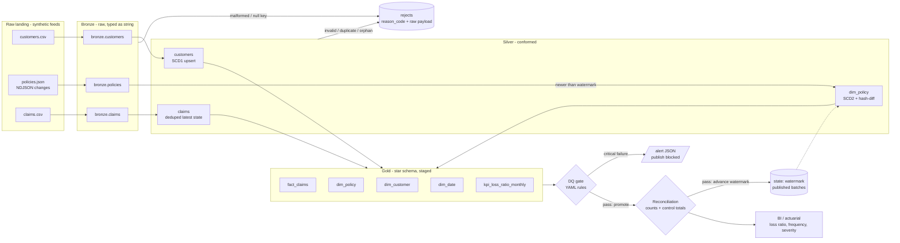

# Insurance Claims Lakehouse (PySpark)

[](https://github.com/vijayakompalli9/insurance-claims-lakehouse-pyspark/actions/workflows/ci.yml) [](https://github.com/vijayakompalli9/insurance-claims-lakehouse-pyspark/actions/workflows/demo.yml) 

> **Portfolio project.** Independently built demonstration using synthetic data. It is not code from, or affiliated with, any current or former employer or client. Developed with AI-assisted tooling and reviewed by the author.


## Business problem

Northwind Mutual Insurance (fictional), a P&C and life carrier, gets daily policy, claims and customer feeds from its admin and claims systems. The feeds arrive with the usual problems: claim rows with no key, negative reserves, re-sent duplicates, claims against policies nobody has heard of, impossible dates, and policy attributes (premium, deductible, status, coverage) that change between drops. Actuarial and finance teams need a **trusted star schema** for loss-ratio and claims-exposure reporting. That means bad data is quarantined with a reason, never silently dropped. Policy history is kept so each claim is tied to the policy terms in force on its loss date. Nothing reaches the reporting layer unless it passes quality gates and reconciles to the source.

## Try it without installing anything

1. Open the [**Run demo** workflow](https://github.com/vijayakompalli9/insurance-claims-lakehouse-pyspark/actions/workflows/demo.yml).
2. Click **Run workflow** (you need to be signed in to GitHub), then open the run when it finishes, in about 2–4 minutes.
3. Read the results on the run's **Summary** page, or download the `*-demo-output` artifact.

The demo generates two daily batches of synthetic feeds, runs bronze → silver → gold, and posts the data-quality report and reconciliation to the run summary. It then reruns batch 1 with a deliberately strict rule to show the circuit breaker blocking the gold publish (exit code 2).

Tested with PySpark 4 · Python 3.13 · Java 21. Every push to `main` also runs the [CI workflow](https://github.com/vijayakompalli9/insurance-claims-lakehouse-pyspark/actions/workflows/ci.yml): lint, the full test suite and a smoke run.

## What this demonstrates

- **Medallion architecture** (bronze, silver, gold) in PySpark 4, with explicit landing schemas and ingestion metadata (`batch_id`, `source_file`, `ingested_at`)
- **Quarantine with reason codes** (`MALFORMED_RECORD`, `NULL_KEY`, `INVALID_DATE`, `INVALID_NUMBER`, `NEGATIVE_AMOUNT`, `DUPLICATE_KEY`, `UNKNOWN_POLICY`, `UNKNOWN_CUSTOMER`). Every rejected row is kept with its raw payload
- **SCD Type 2** `dim_policy` with SHA-256 hash-diff change detection, applied incrementally across batches using a persisted **watermark**. It handles several changes in one batch, suppresses no-op "touches" and is idempotent on replay
- **Window-function dedupe** (newest record wins, deterministic tie-break) and cross-batch upserts
- **Point-in-time fact join**: each claim binds to the policy version in force on its `loss_date`
- **Config-driven DQ engine** (YAML: `not_null`, `unique`, `range`, `accepted_values`, `referential`, with `where` filters and tolerances). A **circuit breaker** blocks the gold publish on any critical failure and emits an alert payload
- **Post-load reconciliation**: source vs. target row counts, exact-decimal **control totals**, and every reject accounted for. Source figures come from the raw files via the stdlib, independently of Spark
- **Atomic publish** (stage, then promote), batch-order enforcement, idempotent re-runs, structured key=value logging and custom exceptions with meaningful exit codes
- **PII minimisation** in gold: email is SHA-256 hashed, names are dropped, and date of birth is reduced to birth year and age band
- Engineering hygiene: pytest with a session-scoped SparkSession, ruff, Makefile, Dockerfile and GitHub Actions CI with Java set up

## Architecture



Per batch, `run_batch` executes: bronze, silver (customers, then policies, then claims, so referential checks see this batch's new keys), stage gold, DQ gate, promote gold, reconcile, and finally advance the watermark and record the published batch.

## Tech stack

| Concern | Choice |
|---|---|
| Compute | PySpark 4.0.4, `local[2]`, ANSI SQL mode on, session TZ UTC |
| Storage | Parquet tables (Delta-ready via `storage.py`; see Design decisions) |
| Config | YAML (`config/config.example.yaml`, `config/dq_rules.yaml`) + env overrides |
| Runtime | Python 3.11+ (tested on 3.13), OpenJDK 21 |
| Quality | pytest 9, ruff 0.16 |
| Packaging | `pyproject.toml` (src layout), Docker, GitHub Actions |

## Project layout

```
insurance-claims-lakehouse-pyspark/
├── src/claims_lakehouse/
│   ├── generate_data.py    # seeded synthetic feeds, 2 batches, deliberate bad rows
│   ├── schemas.py          # explicit landing schemas, feed registry, reason codes
│   ├── bronze.py           # PERMISSIVE ingest + metadata + bronze quarantine
│   ├── silver.py           # type conformance, reason rules, dedupe, upserts
│   ├── scd2.py             # hash-diff SCD Type 2 merge for dim_policy
│   ├── gold.py             # star schema + KPI mart, staged build / promote
│   ├── dq.py               # YAML rules engine, report, alert payload
│   ├── reconciliation.py   # source profiling + count/control-total checks
│   ├── rejects.py          # quarantine contract
│   ├── state.py            # watermark + batch-order guard
│   ├── storage.py          # read/write/stage/promote (single swap point for Delta)
│   ├── config.py · spark.py · logging_utils.py · exceptions.py
│   └── run.py              # CLI: python -m claims_lakehouse.run --batch 1|2|all
├── config/
│   ├── config.example.yaml
│   └── dq_rules.yaml
├── tests/                  # SCD2, dedupe, quarantine, DQ/circuit breaker, recon, e2e
├── docs/sample_output/     # real artefacts from a local run
├── .github/workflows/ci.yml
├── Dockerfile · .dockerignore · Makefile · pyproject.toml
├── requirements.txt · requirements-dev.txt · .env.example · LICENSE
```

## Quickstart

Prerequisites: Python 3.11+ and Java 17/21 on `PATH`.

```bash
python -m venv .venv && source .venv/bin/activate
make install                      # pip install -r requirements-dev.txt && pip install -e .
make data                         # optional: run auto-generates data if data/raw is missing
python -m claims_lakehouse.run --batch 1      # initial load
python -m claims_lakehouse.run --batch 2      # incremental: SCD2 changes, claim updates
# or both in one go, from a clean lakehouse:
python -m claims_lakehouse.run --batch all --reset
make test                         # 22 tests, about 2.5 minutes (Spark start-up dominates)
make lint
```

Exit codes: `0` success, `2` DQ circuit breaker opened, `3` reconciliation failed, `1` other pipeline error (for example a batch out of order).

To see the circuit breaker trip, point the run at a stricter rules file:

```bash
python -m claims_lakehouse.run --batch 1 --reset --rules path/to/strict_rules.yaml   # exit 2
```

## Sample output

Real output from `python -m claims_lakehouse.run --batch all --reset` (stdout, Spark logs removed):

```
== batch 1 | DQ gate PASSED (15/15) | reconciliation PASSED
entity      source  bronze  silver  rejected  stale
customers     1001    1000    1000         1      0
policies      1338    1336    1336         2      0
claims          96      92      80        16      0

== batch 2 | DQ gate PASSED (15/15) | reconciliation PASSED
entity      source  bronze  silver  rejected  stale
customers       26      25      25         1      0
policies        78      76      61         2     15
claims         106     102      90        16      0

== gold table row counts
dim_date                     730
dim_customer                1015
dim_policy                  1392
fact_claims                  160
kpi_loss_ratio_monthly         8

== kpi_loss_ratio_monthly (trimmed)
|month_start|product_line|policies_in_force|claim_count|earned_premium|incurred_losses|loss_ratio|claim_frequency|avg_severity|
|2026-01-01 |AUTO        |359              |24         |49143.87      |44620.40       |0.908     |0.0669         |1859.18     |
|2026-01-01 |COMMERCIAL  |349              |15         |223510.88     |87979.62       |0.3936    |0.043          |5865.31     |
|2026-02-01 |AUTO        |319              |21         |43442.63      |48110.01       |1.1074    |0.0658         |2290.95     |
|2026-02-01 |HOME        |278              |20         |31447.33      |55399.89       |1.7617    |0.0719         |2769.99     |
```

Structured log lines (stderr):

```
ts=2026-10-02T18:28:01Z level=INFO logger=claims_lakehouse.silver msg="silver conformed" entity=claims input=102 accepted=90 rejected=12 skipped_stale=0 reasons={'NEGATIVE_AMOUNT': 3, 'UNKNOWN_POLICY': 3, 'INVALID_DATE': 3, 'INVALID_NUMBER': 1, 'DUPLICATE_KEY': 2}
ts=2026-10-02T18:28:10Z level=INFO logger=claims_lakehouse.run msg="batch complete" batch=2 watermark=2026-02-28 12:47:19.000000
ts=2026-10-02T18:29:04Z level=ERROR logger=claims_lakehouse.run msg="circuit breaker open - gold NOT published" batch=1 alert=.../_reports/alert_batch_1.json
```

How to read batch 2 for policies: of 76 bronze rows, 15 are stale re-sends at or before the watermark and are skipped, and 61 are applied. Of those 61, 5 are "touched" records with identical attributes, which hash-diff suppresses. That leaves 41 new versions (40 changes plus one policy changed twice) and 15 new policies, so `dim_policy` grows from 1,336 to 1,392 rows.

More artefacts in [`docs/sample_output/`](docs/sample_output/): DQ report (markdown), reconciliation JSON, a circuit-breaker alert payload, the KPI table as CSV, the batch-2 claims rejects, and an SCD2 history example.

## Configuration

| Setting | Where | Default |
|---|---|---|
| `raw_root`, `lakehouse_root` | `config/config.yaml` (copy from `config.example.yaml`) or `CLAIMS_RAW_ROOT` / `CLAIMS_LAKEHOUSE_ROOT` | `data/raw`, `data/lakehouse` |
| DQ rules | `config/dq_rules.yaml` or `--rules` | 15 rules (11 critical, 4 warning) |
| Spark master / shuffle partitions | `spark:` block | `local[2]`, `4` |
| Generator seed | `seed` | `42` |

A rule looks like this:

```yaml
- name: policy_one_current_version
  table: silver.dim_policy
  type: unique
  column: policy_id
  where: is_current = true
  severity: critical        # critical => circuit breaker; warning => report only
  max_failure_pct: 0        # optional tolerance
```

Lakehouse layout: `bronze/<entity>/batch_id=N`, `silver/{customers,dim_policy,claims}`, `gold/<table>`, `rejects/<entity>/batch_id=N/layer=bronze|silver`, `_reports/` (DQ, reconciliation, alerts), `_state/pipeline_state.json`.

## Design decisions

- **Bronze is all-string.** Landing every field as `STRING` with a `_corrupt_record` column means a bad date or number becomes a visible reject reason in silver instead of a silent null. Bronze only rejects rows that are unusable (unparseable, or no key).
- **First failing rule wins.** Each rejected row carries exactly one reason code, in a fixed order (dates, numbers, sign, references), so reject counts add up and reconcile.
- **Validate, then dedupe.** Duplicates are resolved only among valid rows, so an invalid "latest" row cannot shadow an older valid one. Superseded copies are quarantined as `DUPLICATE_KEY` so the counts still balance.
- **SCD2 semantics.** Intervals are half-open `[effective_from, effective_to)` timestamps, with the open end at `9999-12-31`. The first version starts at `policy_start` so historical claims bind correctly. Later versions start at the source `updated_at`. `policy_sk = xxhash64(policy_id, effective_from)` is deterministic, so replays create identical keys. A per-key guard ignores incoming records at or before the open version.
- **Watermark plus hash-diff.** The watermark (max applied `updated_at`) cheaply discards re-sends. The hash-diff catches records whose timestamp moved but whose attributes did not. The watermark is formatted inside Spark (UTC) so the driver's local time zone can never shift it. It advances only after gold is published and reconciled, so a blocked batch is simply re-run.
- **Gold is derived, staged, then promoted.** Gold is rebuilt from silver each run, which keeps it idempotent. DQ runs against silver plus the staged gold tables. Promotion is a directory swap, so consumers never see a half-published batch.
- **Earned premium** is annual premium / 12 for each ACTIVE policy version in force at month end, where the policy term overlaps the month. **Incurred losses** exclude DENIED claims. These are deliberately simple conventions for a demo. They are not actuarial earned/incurred definitions (no IBNR, no pro-rata earning).
- **Parquet instead of Delta Lake.** `delta-spark` installs from PyPI, but its JVM jars resolve from Maven Central at session start, and that was not reachable from the build environment. Spark 4.0 pairs with Delta 4.0.x. So the tables are Parquet, and all I/O goes through `storage.py`. The layer contracts map directly onto Delta Lake and Unity Catalog. `publish`/`promote` become `MERGE INTO` (SCD2 and upserts) or `INSERT OVERWRITE` inside a single ACID transaction. Dynamic partition overwrite becomes `replaceWhere`. Rejects become a Delta table with a `reason_code` CHECK constraint. The DQ gate maps to Delta constraints or Lakeflow/DLT expectations. The schemas become UC tables in `bronze`/`silver`/`gold` schemas with grants per layer.

## Cloud deployment mapping

This was built and run locally only. It has **not** been deployed to any cloud. The mapping shows how the same contracts would land on each platform:

| Component | AWS | Azure |
|---|---|---|
| Raw landing | S3 `s3://<bucket>/raw/batch_N/` | ADLS Gen2 container `raw/` |
| Bronze/silver/gold storage | S3 + Delta Lake (Databricks on AWS) or Glue Data Catalog tables; Iceberg on Glue as an alternative | ADLS Gen2 + Delta Lake (Azure Databricks) |
| Compute | Databricks on AWS jobs cluster, or AWS Glue 5 Spark jobs | Azure Databricks jobs cluster |
| Catalog and governance | Unity Catalog (Databricks) or Glue Data Catalog + Lake Formation permissions | Unity Catalog |
| Orchestration | Databricks Workflows, Amazon MWAA (Airflow) or Step Functions | Databricks Workflows or Azure Data Factory |
| Watermark/state | Delta table or DynamoDB item | Delta table |
| DQ alert payload | SNS topic / EventBridge, then on-call | Event Grid / Logic App, then Teams |
| Secrets | Secrets Manager / Databricks secret scopes | Key Vault-backed secret scopes |
| BI | QuickSight / Databricks SQL | Power BI / Databricks SQL |

Only `storage.py` (paths and format) and the alert sink would change. The transformation, DQ and reconciliation code is platform-neutral.

## Security considerations

- Synthetic data only: no real people, policies or companies. Emails use the reserved `example.test` domain.
- No secrets in the repo. `.env` and `config/config.yaml` are git-ignored, and only `.example` files with placeholders are committed. No credentials or network are needed to run or test.
- Gold `dim_customer` hashes email (SHA-256) and drops names and full date of birth. Analysts get segment, state, birth year and age band. In production you would use a keyed or salted hash or tokenisation, with column masks / row filters in Unity Catalog.
- Rejects keep the raw payload for root-cause analysis. On a real platform that area should have stricter access than gold.
- The Docker image runs as a non-root user.
- Alert payloads are written to disk, not sent. A webhook or SNS adapter would sit behind the same JSON contract.

## Testing

`make test` runs **22 tests, all passing** (about 2.5 minutes, using one session-scoped SparkSession):

| File | Covers |
|---|---|
| `test_scd2.py` | initial load, change close/open, hash-diff no-op suppression, two changes in one batch, new policy, invariants (one current per key, unique SK), idempotent replay |
| `test_dedupe.py` | latest-wins dedupe, deterministic tie-break, first-failure reason ordering |
| `test_quarantine.py` | exact reject counts per reason code, bronze vs. silver layer, specific bad IDs, nothing bad leaks into silver |
| `test_dq.py` | each rule type (parametrised), `where` filters, tolerance and severity, invalid config, **circuit breaker** (no gold, staging discarded, alert JSON, watermark not advanced, then clean recovery on re-run) |
| `test_reconciliation.py` | source profile math: counts, malformed and unparseable amounts excluded, exact `Decimal` totals |
| `test_end_to_end.py` | full CLI run of both batches, reconciliation and DQ reports PASSED, fact/dim counts, point-in-time binding, claim lifecycle updates, KPI sanity, PII removed, idempotent batch-2 replay, batch-order enforcement |

## Limitations

- Local filesystem only. Promotion relies on directory rename, which is not atomic on object stores; that is exactly what Delta transactions solve.
- Gold is rebuilt in full every run. That is fine at demo scale, but production would use incremental MERGE into gold.
- A global timestamp watermark can drop genuinely late-arriving records. Production CDC would use a source sequence number or ingestion-time watermark, with a late-data quarantine.
- `dim_customer` is SCD1. Customer attribute history is not kept.
- KPI definitions are simplified (see Design decisions), and claim reserves are taken as reported, with no development triangles.
- The Docker image was written but **not built**, because no Docker daemon was available in the build environment.

## Future enhancements

- Switch `storage.py` to Delta Lake (`MERGE`, `replaceWhere`, constraints, time travel), and register tables in Unity Catalog.
- Orchestrate with Airflow or Databricks Workflows, with one task per layer and the DQ gate as a short-circuit task.
- Send alerts through a pluggable sink interface (SNS, Teams, PagerDuty), and add DQ trend history and anomaly detection on volumes.
- Add data contracts (JSON Schema / ODCS) for the feeds, and schema-evolution handling in bronze.
- Add claims development triangles and IBNR-style exposure views in gold.

## License

MIT, Copyright (c) 2026 Vijaya Lakshmi Kompalli. See [LICENSE](LICENSE).
